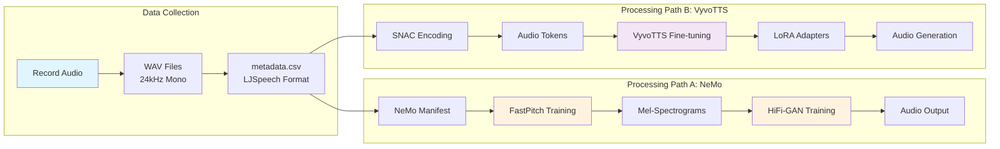
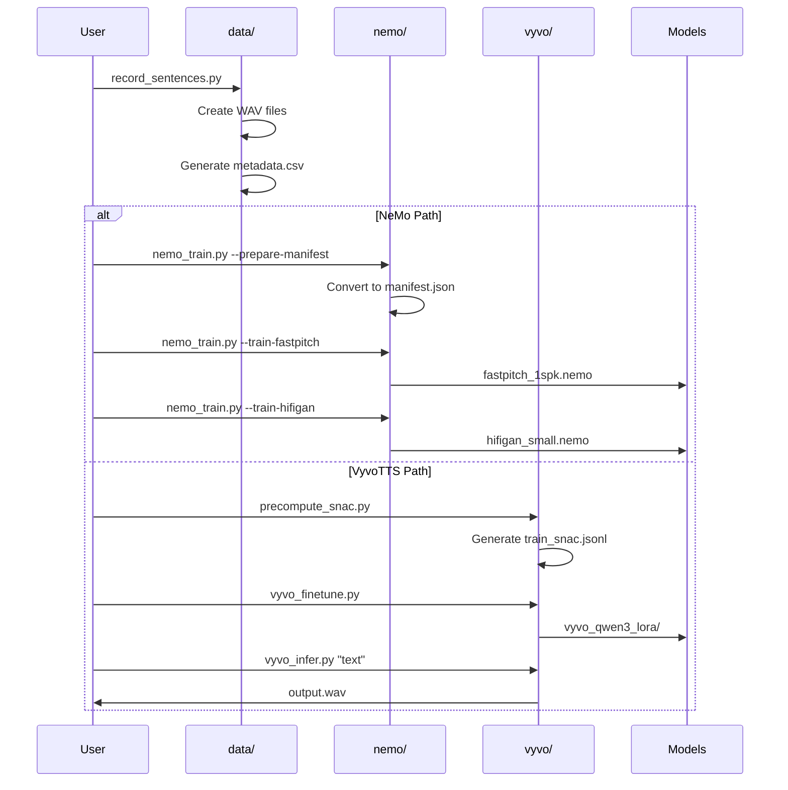

# Text-to-Speech Training Pipeline

This repository contains a complete pipeline for training single-speaker text-to-speech (TTS) models using two different approaches: NVIDIA NeMo and VyvoTTS with SNAC audio codec.

## Project Structure

```plaintext
├── data/           # Audio recording and dataset preparation
├── nemo/           # NVIDIA NeMo TTS training
├── vyvo/           # VyvoTTS with SNAC codec training
└── configs/        # Configuration files for training
```

## Architecture Overview



## Training Pipeline Sequence



## Quick Start

Each subfolder is an independent uv project with its own dependencies:

1. **Data Collection**: Record audio samples and prepare datasets

   ```bash
   cd data && uv run record_sentences.py --sentences sentences_en.txt
   ```

2. **NeMo Training**: Train FastPitch + HiFi-GAN models

   ```bash
   cd nemo && uv run nemo_train.py --prepare-manifest --train-fastpitch
   ```

3. **VyvoTTS Training**: Fine-tune VyvoTTS with SNAC codec

   ```bash
   cd vyvo && uv run precompute_snac.py && uv run vyvo_finetune.py
   ```

## Features

- **Multi-language support**: English and Spanish sentence datasets
- **Professional audio recording**: 24kHz mono WAV format optimized for TTS
- **Two training approaches**:
  - Traditional acoustic modeling (NeMo FastPitch + HiFi-GAN)
  - Modern language model approach (VyvoTTS + SNAC)
- **GPU optimization**: Configurations for 8GB VRAM constraints
- **Production ready**: Complete inference scripts for both approaches

## Requirements

- **Python**: 3.8+ (varies by component)
- **GPU**: NVIDIA GPU with 8GB+ VRAM recommended
- **Audio**: Microphone for recording training data
- **Storage**: Several GB for audio files and model checkpoints

## Documentation

See individual README files in each subfolder for detailed setup and usage instructions:

- [`data/README.md`](data/README.md) - Audio recording and dataset preparation
- [`nemo/README.md`](nemo/README.md) - NVIDIA NeMo TTS training
- [`vyvo/README.md`](vyvo/README.md) - VyvoTTS with SNAC codec

## License

This project is for educational and research purposes. Please respect the licenses of the underlying frameworks:

- NVIDIA NeMo (Apache 2.0)
- VyvoTTS (Model-specific license)
- SNAC codec (Repository license)
