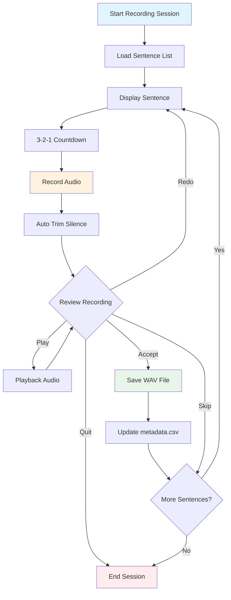
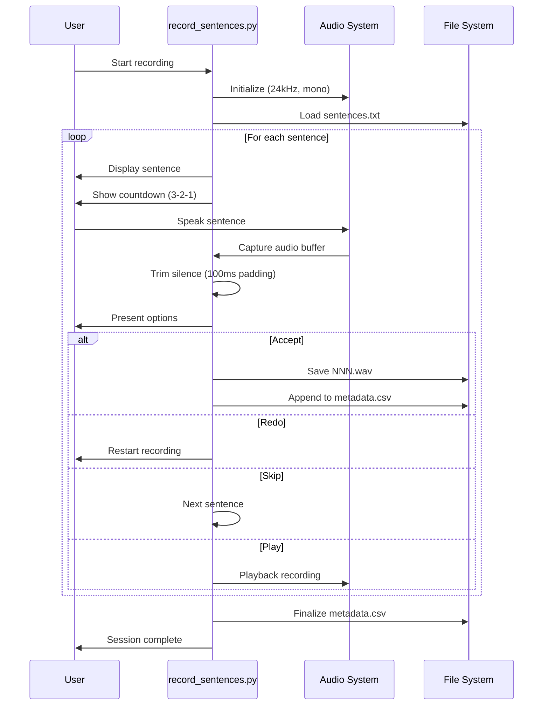
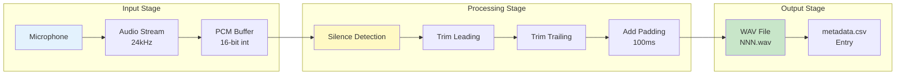

# Data Recording and Preparation

This folder contains tools for recording high-quality audio samples and preparing datasets for TTS training.

## Overview

The data pipeline consists of:

1. **Sentence lists** for English and Spanish
2. **Interactive recording tool** with playback and quality control
3. **Audio device management** for optimal recording setup
4. **Automated metadata generation** in LJSpeech format

## Data Recording Flow



## Recording Process Sequence



## Audio Processing Pipeline



## Files

- `record_sentences.py` - Interactive recording script
- `list_audio_devices.py` - Audio device detection and setup
- `sentences_en.txt` - English sentences for recording
- `sentences_es.txt` - Spanish sentences for recording
- `metadata.csv` - Generated metadata in LJSpeech format
- `wavs/` - Recorded audio files (24kHz mono WAV)

## Setup

Install dependencies:

```bash
uv sync
```

On Linux, you may need system audio libraries:

```bash
sudo apt-get install libportaudio2
```

## Usage

### 1. Check Audio Devices

List available microphones and speakers:

```bash
uv run list_audio_devices.py
```

### 2. Record Training Data

Record English sentences:

```bash
uv run record_sentences.py --sentences sentences_en.txt
```

Record Spanish sentences:

```bash
uv run record_sentences.py --sentences sentences_es.txt
```

### 3. Recording Options

**Basic recording** (6 seconds per sentence):

```bash
uv run record_sentences.py --sentences sentences_en.txt --duration 6.0
```

**Custom sample rate** (default 24kHz for SNAC compatibility):

```bash
uv run record_sentences.py --sentences sentences_en.txt --samplerate 24000
```

**Specify audio device**:

```bash
uv run record_sentences.py --sentences sentences_en.txt --device "USB Microphone"
```

**Resume from specific index**:

```bash
uv run record_sentences.py --sentences sentences_en.txt --start-index 50
```

## Recording Process

1. **Prepare**: Read the sentence displayed on screen
2. **Record**: Press Enter and speak after the countdown
3. **Review**: Listen to the recording with [P]lay
4. **Decide**: [A]ccept, [R]edo, [S]kip, or [Q]uit
5. **Continue**: Move to next sentence automatically

## Audio Quality

- **Format**: 24kHz mono WAV (PCM 16-bit)
- **Duration**: Typically 3-8 seconds per sentence
- **Processing**: Automatic silence trimming with 100ms padding
- **Quality**: Professional TTS training quality

## Output Format

The script generates `metadata.csv` in LJSpeech format:

```plaintext
001.wav|Hello, this is a test sentence.
002.wav|The quick brown fox jumps over the lazy dog.
```

Each audio file is saved as `NNN.wav` in the `wavs/` directory.

## Tips for Good Recordings

1. **Environment**: Record in a quiet room with minimal echo
2. **Microphone**: Use a good quality USB or XLR microphone
3. **Distance**: Maintain consistent distance from microphone
4. **Pace**: Speak at natural, consistent pace
5. **Pronunciation**: Clear articulation, avoid mumbling
6. **Consistency**: Keep same voice characteristics throughout

## Troubleshooting

**No audio devices found**:

- Check microphone connection
- Restart audio system: `pulseaudio -k && pulseaudio --start`

**Poor audio quality**:

- Check microphone levels in system settings
- Test with different sample rates
- Verify microphone is not muted

**Permission errors**:

- Ensure microphone access permissions
- Run with appropriate user permissions
