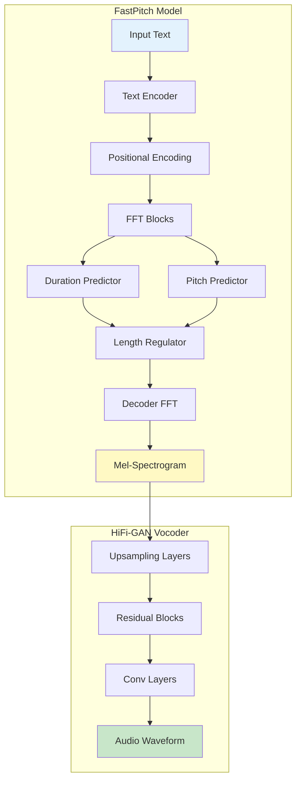
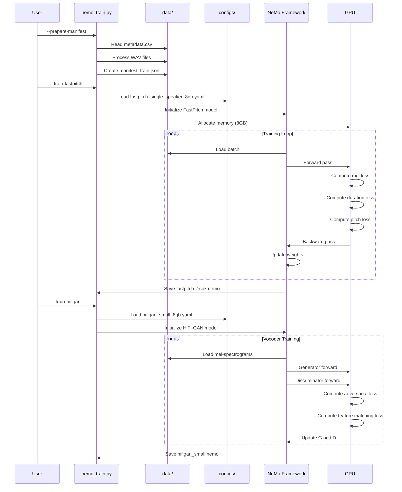

# NVIDIA NeMo TTS Training

This folder contains scripts for training single-speaker TTS models using NVIDIA NeMo framework with FastPitch (acoustic model) and HiFi-GAN (vocoder).

## Overview

NeMo provides a traditional two-stage TTS approach:

1. **FastPitch**: Acoustic model that converts text to mel-spectrograms
2. **HiFi-GAN**: Vocoder that converts mel-spectrograms to audio

## NeMo TTS Architecture



## Training Pipeline Sequence



## Data Flow Through Models

```mermaid
graph LR
    subgraph "Input Processing"
        A[Text Input] --> B[Tokenization]
        B --> C[Phoneme Conversion]
        C --> D[Embedding Layer]
    end
    
    subgraph "FastPitch Processing"
        D --> E[Encoder Stack<br/>6 FFT Blocks]
        E --> F[Attention Mechanism]
        F --> G[Duration Alignment]
        G --> H[Pitch Embedding]
        H --> I[Decoder Stack<br/>6 FFT Blocks]
        I --> J[Linear Projection]
        J --> K[80-dim Mel-Spectrogram]
    end
    
    subgraph "HiFi-GAN Processing"
        K --> L[Conv Pre-net]
        L --> M[Upsampling x256]
        M --> N[Multi-Receptive Field<br/>Fusion]
        N --> O[Post-net]
        O --> P[24kHz Audio]
    end
    
    style A fill:#e1f5fe
    style K fill:#fff3e0
    style P fill:#e8f5e9
```



## Files

- `nemo_train.py` - Main training script for both models
- Training outputs in `checkpoints/fastpitch/` and `checkpoints/hifigan/`

## Setup

Install dependencies:

```bash
uv sync
```

Ensure you have recorded audio data in the `data/` folder with `metadata.csv`.

## Usage

### 1. Prepare Training Manifest

Convert LJSpeech metadata to NeMo JSONL format:

```bash
uv run nemo_train.py --prepare-manifest
```

This creates `data/manifest_train.json` with entries like:

```json
{"audio_filepath": "data/wavs/001.wav", "text": "Hello world", "duration": 2.5}
```

### 2. Train FastPitch (Acoustic Model)

Train the text-to-mel-spectrogram model:

```bash
uv run nemo_train.py --train-fastpitch
```

**Configuration**: Uses `configs/fastpitch_single_speaker_8gb.yaml`

**Output**: `checkpoints/fastpitch/fastpitch_1spk.nemo`

**Training time**: Several hours depending on dataset size

### 3. Train HiFi-GAN (Vocoder)

Train the mel-spectrogram-to-audio model:

```bash
uv run nemo_train.py --train-hifigan
```

**Configuration**: Uses `configs/hifigan_small_8gb.yaml`

**Output**: `checkpoints/hifigan/hifigan_small.nemo`

**Training time**: Several hours for convergence

## Configuration Files

### FastPitch Config (`configs/fastpitch_single_speaker_8gb.yaml`)

- Optimized for 8GB GPU memory
- Single speaker setup (no speaker embeddings)
- Attention-based duration predictor
- 24kHz audio support

### HiFi-GAN Config (`configs/hifigan_small_8gb.yaml`)

- Small model variant for memory efficiency
- Multi-period discriminator
- Optimized for FastPitch mel-spectrograms

## Memory Requirements

- **8GB GPU**: Configurations are optimized for this constraint
- **16GB+ GPU**: Can increase batch sizes for faster training
- **CPU training**: Possible but very slow

## Training Tips

1. **Dataset Size**: Minimum 30 minutes of audio recommended
2. **Quality**: Consistent voice, clear pronunciation crucial
3. **Preprocessing**: Ensure 24kHz mono WAV format
4. **Monitoring**: Check TensorBoard logs for loss curves
5. **Convergence**: FastPitch ~10k steps, HiFi-GAN ~100k steps

## Inference

After training, use the saved `.nemo` checkpoints for inference:

```python
from nemo.collections.tts.models import FastPitchModel, HifiGanModel

# Load models
fastpitch = FastPitchModel.restore_from("checkpoints/fastpitch/fastpitch_1spk.nemo")
hifigan = HifiGanModel.restore_from("checkpoints/hifigan/hifigan_small.nemo")

# Generate speech
mel = fastpitch.generate_spectrogram(text="Hello world")
audio = hifigan.convert_spectrogram_to_audio(spec=mel)
```

## Troubleshooting

**CUDA out of memory**:

- Reduce batch size in config files
- Use gradient checkpointing
- Consider model quantization

**Poor audio quality**:

- Check training data quality
- Increase HiFi-GAN training steps
- Verify mel-spectrogram alignment

**Training instability**:

- Lower learning rate
- Check data preprocessing
- Monitor discriminator/generator balance

**Slow convergence**:

- Verify data diversity
- Check attention alignment plots
- Consider pre-trained checkpoints
