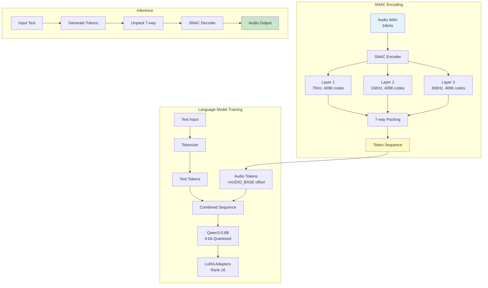
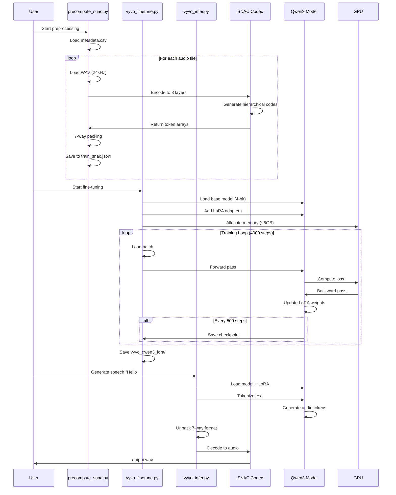
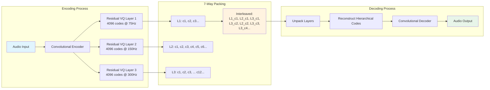
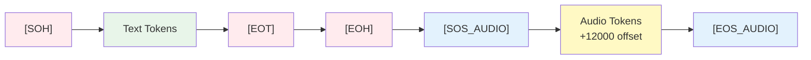
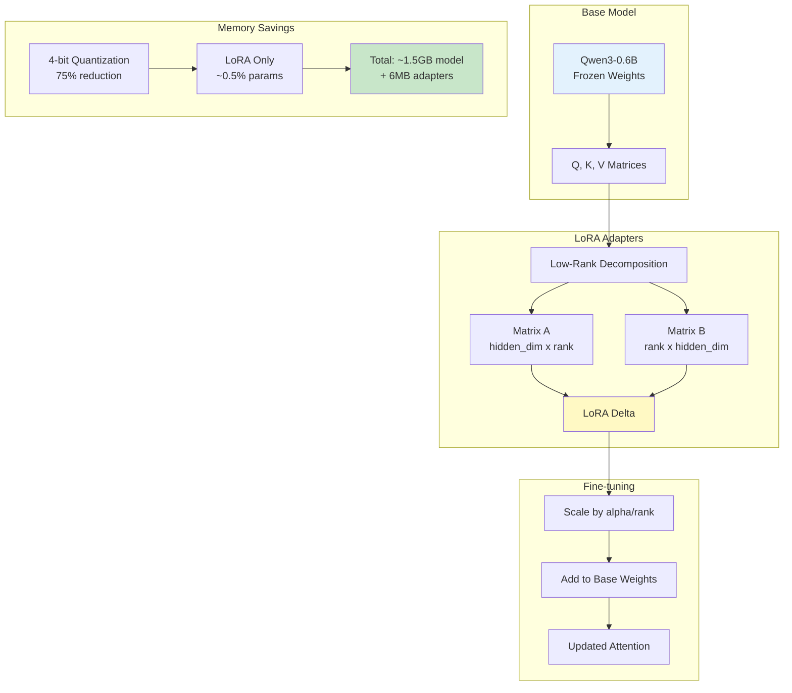

# VyvoTTS with SNAC Codec Training

This folder contains scripts for training and inference using VyvoTTS, a modern language model approach to TTS that uses SNAC (Scalable Neural Audio Codec) for high-quality audio generation.

## Overview

VyvoTTS represents a paradigm shift in TTS:

1. **Language Model Approach**: Treats TTS as a text-to-audio-token sequence task
2. **SNAC Codec**: Hierarchical neural audio codec for efficient audio representation
3. **LoRA Fine-tuning**: Parameter-efficient adaptation of pre-trained models

## VyvoTTS Architecture



## Training Pipeline Sequence



## SNAC Codec Processing



## Token Sequence Format



## Files

- `precompute_snac.py` - Convert audio to SNAC token sequences
- `vyvo_finetune.py` - Fine-tune VyvoTTS with LoRA adapters
- `vyvo_infer.py` - Generate speech from text using trained model

## Setup

Install dependencies:

```bash
uv sync
```

Ensure you have recorded audio data in the `data/` folder with `metadata.csv`.

## Workflow

### 1. Precompute SNAC Codes

Convert your WAV files to SNAC token sequences:

```bash
uv run precompute_snac.py
```

**Input**: `data/metadata.csv` and `data/wavs/*.wav`

**Output**: `data/train_snac.jsonl` with format:

```json
{"text": "Hello world", "codes": [12045, 8192, 16384, ...]}
```

**Process**:

- Loads 24kHz mono WAV files
- Encodes to 3-layer SNAC representation
- Packs to 7-way token stream for language modeling

### 2. Fine-tune VyvoTTS

Adapt the pre-trained VyvoTTS model to your voice:

```bash
uv run vyvo_finetune.py
```

**Base Model**: `Vyvo/VyvoTTS-v0-Qwen3-0.6B`

**Method**: LoRA (Low-Rank Adaptation) fine-tuning

**Output**: `vyvo_qwen3_lora/` directory with adapters

**Training Details**:

- 4000 training steps
- 4-bit quantization for memory efficiency
- LoRA rank 16, alpha 32
- Learning rate 2e-4

### 3. Generate Speech

Use the fine-tuned model for inference:

```bash
uv run vyvo_infer.py "Hello, this is a test." output.wav
```

**Models Required**:

- Base: `Vyvo/VyvoTTS-v0-Qwen3-0.6B`
- SNAC: `hubertsiuzdak/snac_24khz`
- Fine-tuned adapters (if available)

## LoRA Adaptation Flow



## Technical Details

### SNAC Codec

SNAC uses a hierarchical approach with 3 layers:

- **Layer 1**: 4096 codes, frame rate 75Hz
- **Layer 2**: 4096 codes, frame rate 150Hz  
- **Layer 3**: 4096 codes, frame rate 300Hz

The 7-way packing scheme interleaves codes for language model training.

### Token Format

The language model processes sequences like:

```plaintext
[SOH] text tokens [EOT] [EOH] [SOS_AUDIO] audio tokens [EOS_AUDIO]
```

Where audio tokens are SNAC codes offset by `AUDIO_BASE`.

### Memory Optimization

For 8GB GPU constraints:

- **4-bit quantization**: Reduces model memory by ~75%
- **LoRA adapters**: Only fine-tune small parameter subset
- **Float16 precision**: Halves activation memory

## Model Inference

Load and use trained models:

```python
import torch
from unsloth import FastLanguageModel
from snac import SNAC

# Load fine-tuned model
model, tokenizer = FastLanguageModel.from_pretrained(
    "vyvo_qwen3_lora",  # Your fine-tuned adapters
    dtype=torch.float16,
    load_in_4bit=True
)

# Load SNAC decoder
snac = SNAC.from_pretrained("hubertsiuzdak/snac_24khz")

# Generate audio tokens
tokens = model.generate(...)

# Decode to audio
audio = snac.decode(codes)
```

## Performance Tips

### Training Optimization

1. **Batch Size**: Start with 1, increase if memory allows
2. **Gradient Accumulation**: Simulate larger batches
3. **Checkpoint Frequency**: Save every 500 steps
4. **Mixed Precision**: Use float16 for speed

### Inference Optimization

1. **Temperature**: 0.6-0.8 for natural speech
2. **Top-p**: 0.95 for diversity control
3. **Repetition Penalty**: 1.1 to avoid loops
4. **Max Tokens**: 800 for typical sentences

## Troubleshooting

**CUDA OOM during training**:

- Enable 4-bit quantization
- Reduce LoRA rank to 8
- Use gradient checkpointing

**Poor audio quality**:

- Check SNAC encoding quality
- Verify 24kHz input format
- Increase training steps

**Repetitive output**:

- Adjust repetition penalty
- Increase temperature
- Check training data diversity

**Slow inference**:

- Use smaller max_tokens
- Enable use_cache=True
- Consider model quantization

## Advanced Usage

### Custom LoRA Configuration

Modify `vyvo_finetune.py` for different LoRA settings:

```python
peft_cfg = LoraConfig(
    r=32,              # Higher rank = more parameters
    lora_alpha=64,     # Scaling factor
    lora_dropout=0.1,  # Regularization
    target_modules=[...] # Which layers to adapt
)
```

### Multi-GPU Training

For faster training with multiple GPUs:

```python
from accelerate import Accelerator

accelerator = Accelerator()
model, optimizer, dataloader = accelerator.prepare(
    model, optimizer, dataloader
)
```
